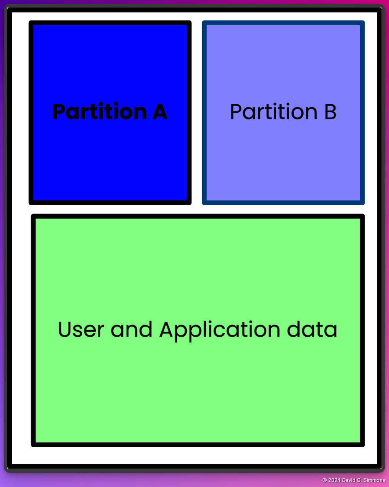

## A/B Partitioning

Some background here is probably appropriate. The idea of A/B partitioning is an important concept for recoverability. If you have a single disk partition that your devices boots from, and you update critical items in that partition that are somehow corrupted, your device may be left in a state where it is impossible to boot or recover. It's bricked. The only way to recover such a device typically is to physically access the device and make direct changes to the SD Card. This is not always practical, or even possible.

With A/B partitioning you create dual boot partitions and only run from one. That is the known-good or primary partition. You then have a secondary partition where you can apply updates. Once an update is applied to the secondary partition, the device reboots from that newly updated partition. If the update is successful, your system is back up and running and that partition is then marked as the primary, and it will reboot from that known-good partition from now on.

If the update fails for some reason and the device cannot properly boot from the updated partition, the system reboots from the previously used primary partition, and it can continue to run until a fixed update can be deployed.

With this partitioning scheme in place, your Pi is much less likely to end up bricked as you can maintain a known-good partition at all times from which to boot.

Bootware encrypts the A, B, and DATA partitions. The A and B partition are locked with unique LUKS keys, meaning you cannot access the Backup partition from the Active partition. The encrypted DATA partition is accessible from either the A or B partition.

Setting up this A/B partitioning scheme is usually quite cumbersome and difficult to implement. Zymbit’s Bootware has taken that process and simplified it such that it’s a relatively easy process. So let’s go through that process now and make your Pi both secure and resilient.

