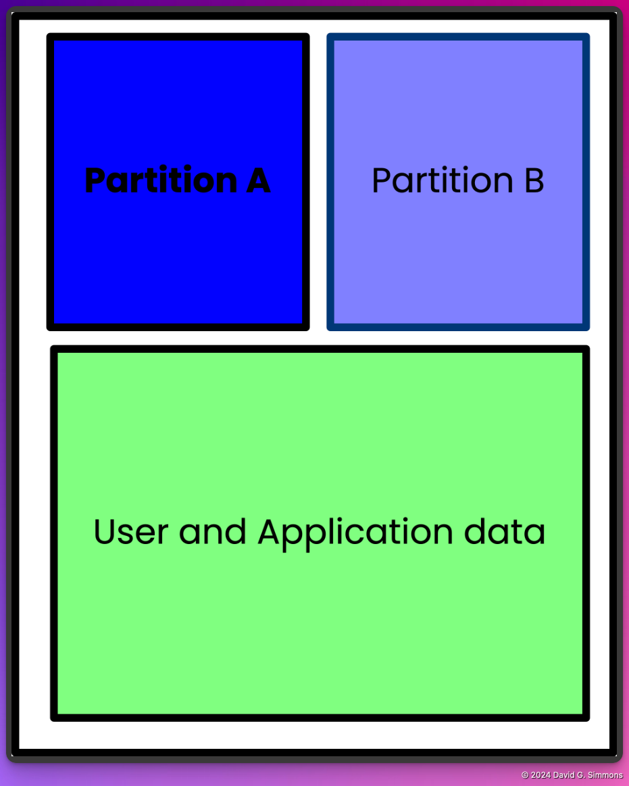

## Partitionnement A/B

Il est probablement approprié de donner un peu de contexte ici. L'idée du partitionnement A/B est un concept important pour la récupérabilité. Si vous avez une seule partition de disque à partir de laquelle vos appareils démarrent et que vous mettez à jour des éléments critiques de cette partition qui sont en quelque sorte corrompus, votre appareil peut être laissé dans un état où il est impossible de démarrer ou de récupérer. Il est bloqué. La seule façon de récupérer un tel appareil est généralement d'accéder physiquement à l'appareil et d'apporter des modifications directes à la carte SD. Ce n'est pas toujours pratique, ni même possible.

Avec le partitionnement A/B, vous créez des partitions à double démarrage et vous n'exécutez qu'à partir d'une seule. Il s'agit de la partition connue ou principale. Vous disposez ensuite d'une partition secondaire sur laquelle vous pouvez appliquer des mises à jour. Une fois qu'une mise à jour est appliquée à la partition secondaire, l'appareil redémarre à partir de cette partition nouvellement mise à jour. Si la mise à jour réussit, votre système est de nouveau opérationnel et cette partition est alors marquée comme principale. Il redémarrera désormais à partir de cette partition connue comme bonne.

Si la mise à jour échoue pour une raison quelconque et que l'appareil ne peut pas démarrer correctement à partir de la partition mise à jour, le système redémarre à partir de la partition principale précédemment utilisée et peut continuer à fonctionner jusqu'à ce qu'une mise à jour fixe puisse être déployée.

Avec ce schéma de partitionnement en place, votre Pi est beaucoup moins susceptible de finir bloqué, car vous pouvez conserver à tout moment une partition connue comme étant en bon état à partir de laquelle démarrer.

Bootware chiffre les partitions A, B et DATA. Les partitions A et B sont verrouillées avec des clés LUKS uniques, ce qui signifie que vous ne pouvez pas accéder à la partition de sauvegarde à partir de la partition active. La partition DATA chiffrée est accessible à partir de la partition A ou B.

La configuration de ce schéma de partitionnement A/B est généralement assez lourde et difficile à mettre en œuvre. Bootware de Zymbit a repris ce processus et l'a simplifié de telle sorte qu'il soit relativement simple. Examinons donc ce processus maintenant et rendons votre Pi à la fois sûr et résilient.


