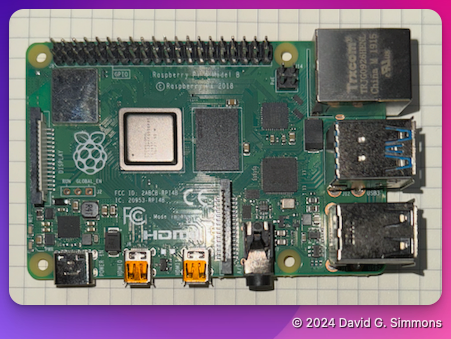

## Übersicht

Lassen Sie uns zunächst die gesamte Hardware und alle Teile in Ihrem Kit durchgehen.

> [!NOTE]
> Die gesamte Hardware nimmst du mit nach Hause! Sie gehört dir.

Zu Beginn werden wir einen Raspberry Pi von Grund auf bauen.

Hier sind alle Teile, die in Ihrem Kit enthalten sind. Ich werde Amazon-Links zu denen einfügen, die wir in diesem Workshop verwenden, falls Sie später Nachschub benötigen. Wenn Ihnen Teile fehlen, lassen Sie es mich bitte wissen

- Raspberry Pi (ich verwende einen [Raspberry Pi 4](https://amzn.to/3Y2BBgn), aber Sie können auch einen [Raspberry Pi 5](https://amzn.to/4dAKfZ3) verwenden, wenn Sie das bevorzugen)
  
- [Netzteil](https://amzn.to/4eWmYSr) für Ihren Pi. Es ist wichtig, ein gutes Netzteil zu verwenden, das genügend Strom für den Pi4 oder Pi5 liefert. Das offizielle Netzteil der Pi Foundation wird empfohlen.
- Hochwertige [Micro-SD-Karte](https://amzn.to/3U2Twm1). Ich empfehle eine 32 GB-Karte.
  
- [SD-Kartenleser/-schreiber](https://amzn.to/4dEs2Kc) (falls in Ihrem Computer keiner eingebaut ist)
  
- Hochwertiger USB-Stick (Hinweis: Er sollte doppelt so groß sein wie Ihre SD-Karte). Mir gefällt [dieser](https://amzn.to/3NrH4Iz) von PNY.
  
- Zymkey, HSM4 oder HSM6 (ich verwende hier einen [Zymkey](https://amzn.to/4eRcIvn), aber ein HSM6 funktioniert genauso gut, wenn Sie eine Hardware-Signierung wünschen)
  
- [CR1025-Batterie](https://amzn.to/4eJG1Qt) (eine Batterie ist nicht unbedingt erforderlich, ich füge sie hier jedoch der Vollständigkeit halber hinzu. Der Zymkey verwendet sie, um die Echtzeituhr (RTC) aufrechtzuerhalten.)

> [!IMPORTANT]
> Wir werden in diesem Workshop keine CD1025-Batterie verwenden. Sie wird nur für den Betrieb der Echtzeituhr auf dem Zymkey benötigt und wir werden diese Funktion nicht verwenden.


