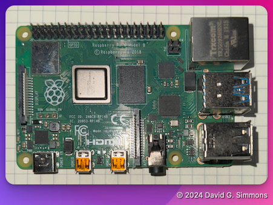
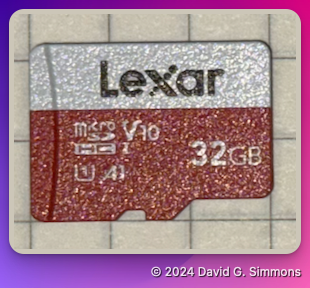
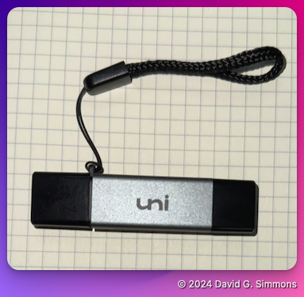
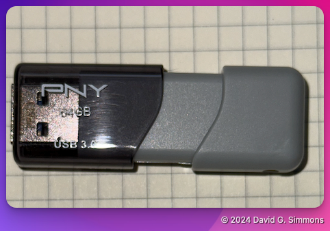
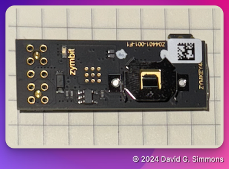

## Overview

First, let's go over all the hardware and parts in your kit.

> [!NOTE]
> You will be taking all of this hardware home with you! It's yours to keep.

To start off, we're going to build a Raspberry Pi from scratch.

Here are all the parts included in your kit. I will include Amazon links to the ones we are using in this workshop in case you want to resupply later. If you're missing any parts, please let me know

- Raspberry Pi (I'm using a [Raspberry Pi 4](https://amzn.to/3Y2BBgn), but you can also use a [Raspberry Pi 5](https://amzn.to/4dAKfZ3) if you prefer)
  
- [Power supply](https://amzn.to/4eWmYSr) for your Pi. It is important to use a good power supply that supplies enough power for the Pi4 or Pi5. The official supply from the Pi foundation is recommended.
- High quality [Micro SD Card](https://amzn.to/3U2Twm1) I recommend a 32GB card.
  
- [SD Card Reader/Writer](https://amzn.to/4dEs2Kc) (if there isn't one built-in to your computer)
  
- High quality USB Flash drive (Note: It should be 2x the size of your SD Card) I like [this one](https://amzn.to/3NrH4Iz) from  from PNY.
  
- Zymkey, HSM4 or HSM6 (I’m using a [Zymkey](https://amzn.to/4eRcIvn) here, but an HSM6 will work just fine if you want Hardware Signing)
  
- [CR1025 Battery](https://amzn.to/4eJG1Qt) (a battery is not strictly necessary, but I’m including it here for completeness. The Zymkey uses it to maintain the Real Time Clock (RTC))

> [!IMPORTANT]
> We will not be using a CD1025 battery in this workshop. It is only required for operating the Real Time Clock on the Zymkey, and we won't be using that function.

