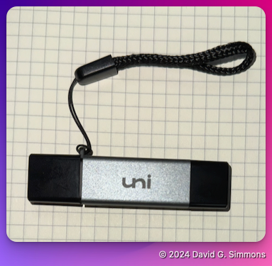

## Descripción general

Primero, repasemos todo el hardware y las piezas de su kit.

> [!NOTE]
> ¡Te llevarás todo este hardware a casa! Es tuyo.

Para empezar, vamos a construir una Raspberry Pi desde cero.

Aquí están todas las piezas incluidas en el kit. Incluiré enlaces de Amazon a las que estamos usando en este taller en caso de que desees reabastecerlas más adelante. Si te falta alguna pieza, avísame.

- Raspberry Pi (estoy usando una [Raspberry Pi 4](https://amzn.to/3Y2BBgn), pero también puedes usar una [Raspberry Pi 5](https://amzn.to/4dAKfZ3) si lo prefieres)
  
- [Fuente de alimentación](https://amzn.to/4eWmYSr) para tu Pi. Es importante utilizar una buena fuente de alimentación que suministre suficiente energía para la Pi4 o Pi5. Se recomienda la fuente de alimentación oficial de la Fundación Pi.
- Tarjeta Micro SD de alta calidad (https://amzn.to/3U2Twm1). Recomiendo una tarjeta de 32 GB.
  
- [Lector/escritor de tarjetas SD](https://amzn.to/4dEs2Kc) (si no hay uno integrado en su computadora)
  
- Unidad flash USB de alta calidad (Nota: debe tener el doble del tamaño de su tarjeta SD) Me gusta [esta](https://amzn.to/3NrH4Iz) de PNY.
  
- Zymkey, HSM4 o HSM6 (estoy usando una [Zymkey](https://amzn.to/4eRcIvn) aquí, pero una HSM6 funcionará bien si desea firma de hardware)
  
- [Batería CR1025](https://amzn.to/4eJG1Qt) (no es estrictamente necesaria una batería, pero la incluyo aquí para completar. La Zymkey la usa para mantener el reloj de tiempo real (RTC))

> [!IMPORTANT]
> No utilizaremos una batería CD1025 en este taller. Solo es necesaria para operar el reloj de tiempo real en el Zymkey y no utilizaremos esa función.


