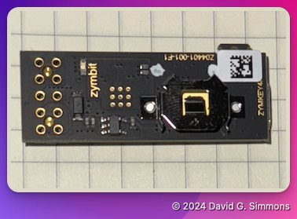

## Aperçu

Tout d’abord, passons en revue tout le matériel et les pièces de votre kit.

> [!NOTE]
> Vous emporterez tout ce matériel chez vous ! Il est à vous.

Pour commencer, nous allons construire un Raspberry Pi à partir de zéro.

Voici toutes les pièces incluses dans votre kit. J'inclurai les liens Amazon vers celles que nous utilisons dans cet atelier au cas où vous souhaiteriez les réapprovisionner plus tard. S'il vous manque des pièces, faites-le moi savoir

- Raspberry Pi (j'utilise un [Raspberry Pi 4](https://amzn.to/3Y2BBgn), mais vous pouvez également utiliser un [Raspberry Pi 5](https://amzn.to/4dAKfZ3) si vous préférez)
  
- [Alimentation](https://amzn.to/4eWmYSr) pour votre Pi. Il est important d'utiliser une bonne alimentation qui fournit suffisamment de puissance pour le Pi4 ou le Pi5. L'alimentation officielle de la fondation Pi est recommandée.
- Carte Micro SD de haute qualité [https://amzn.to/3U2Twm1) Je recommande une carte de 32 Go.
  
- [Lecteur/graveur de carte SD](https://amzn.to/4dEs2Kc) (s'il n'y en a pas un intégré à votre ordinateur)
  
- Clé USB de haute qualité (Remarque : elle doit être deux fois plus grande que votre carte SD). J'aime [celle-ci](https://amzn.to/3NrH4Iz) de PNY.
  
- Zymkey, HSM4 ou HSM6 (j'utilise ici un [Zymkey](https://amzn.to/4eRcIvn), mais un HSM6 fonctionnera très bien si vous souhaitez une signature matérielle)
  
- [Pile CR1025](https://amzn.to/4eJG1Qt) (une pile n'est pas strictement nécessaire, mais je l'inclus ici pour être complet. Le Zymkey l'utilise pour maintenir l'horloge en temps réel (RTC))

> [!IMPORTANT]
> Nous n'utiliserons pas de batterie CD1025 dans cet atelier. Elle est uniquement nécessaire pour faire fonctionner l'horloge en temps réel sur le Zymkey, et nous n'utiliserons pas cette fonction.


