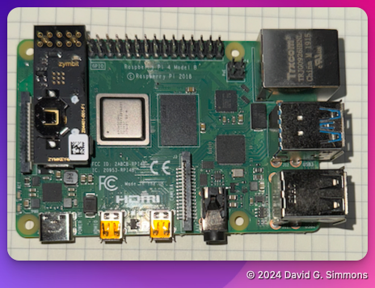

## Zusammenbau der Hardware

Zum Glück gibt es für uns hier nicht viel zu tun (vor allem, da wir nicht die CR1025-Batterie verwenden), aber es gibt etwas.

## Alles auspacken

Alle Bauteile können wir vorab aus den Kartons, Tüten etc. entnehmen. Die Verpackung wird von uns nicht mehr benötigt und kann, sofern nicht nochmal verwendet, entsorgt werden.

## Installieren Sie den Zymkey

Die einzige Montage, die wir durchführen müssen, ist die Installation des Zymkey auf dem Raspberry Pi.

Der Zymkey muss vollständig auf den Stiftleisten des Raspberry Pi sitzen. Er sollte mit dem Ende der Stiftleisten ausgerichtet sein, das dem Displayanschluss am nächsten ist.


