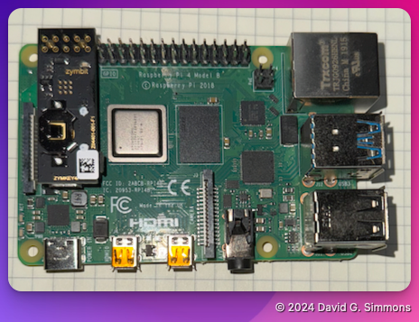

+++
title = 'Hardware Assembly'
date = 2024-10-24T14:16:42-04:00
weight = 1
+++

## Assembling the hardware

Luckily, there isn't much for us to do here (especially since we aren't using the CR1025 battery), but there is some.

## Unpack everything

We can take all the components out of their boxes, bags, etc. to start with. We won't need the packaging again, so you can throw it away unless you want to reuse it.

## Install the Zymkey

The only assembly we need to do is to install the Zymkey on the Raspberry Pi.

The Zymkey needs to be fully seated on the header pins of the Raspberry Pi. It should line up with then end of the header pins on the end closest to the display connector.

