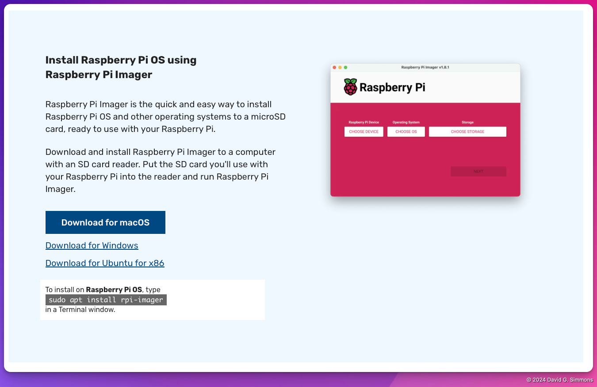

## Descargar Pi Imager

El software Pi Imager de Raspberry Pi Foundation es la forma más sencilla de crear una imagen de sistema operativo adecuada para tu Raspberry Pi. Puedes descargar el software [Pi Imager](https://www.raspberrypi.com/software/) y luego seguir las instrucciones para instalarlo en tu plataforma.


