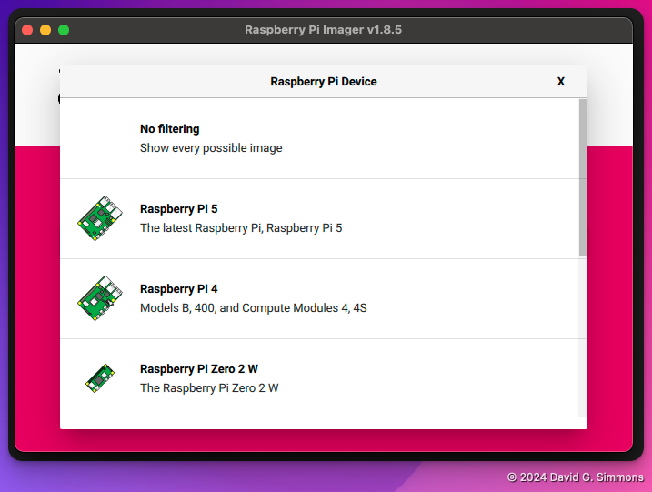

## Pi Imager starten

Wenn Sie den Pi Imager zum ersten Mal starten, werden Sie feststellen, dass Sie einige Entscheidungen treffen müssen:

Zuerst müssen Sie auswählen, welches Pi-Modell Sie haben. Wir verwenden Pi 4s

Als Nächstes wählen Sie das Betriebssystem aus. Wir verwenden die neueste Version (Bookworm, 64-Bit), benötigen aber nicht die vollständige Desktop-Umgebung. Wählen Sie daher die Version „Lite“.

Als Nächstes identifizieren Sie die Micro-SD-Karte, auf die Sie schreiben möchten. Wenn Sie dies noch nicht getan haben, legen Sie die Micro-SD-Karte in den SD-Kartenschreiber ein und schließen Sie ihn an Ihren Computer an.

Der letzte Schritt vor dem eigentlichen Schreiben des Betriebssystems auf die Festplatte besteht darin, alle weiteren Einstellungen vorzunehmen, die Sie für den Pi wünschen. Ich empfehle zumindest, einen Hostnamen und einen Benutzernamen/ein Passwort einzurichten, und wenn Sie Ihr lokales WLAN verwenden möchten, die WLAN-Anmeldeinformationen.

Legen Sie für diese Übung Folgendes fest:
- `hostname`: Wählen Sie etwas Einzigartiges! Wir werden alle im selben LAN sein, also wählen Sie etwas Einzigartiges für dieses LAN.
- `Benutzername`: Ich verwende `zymbit` als Benutzernamen, aber Sie können wählen, was Sie möchten
- `password`: Der Einfachheit halber verwende ich hier auch `zymbit`, aber das ist eindeutig nicht sicher, also wählen Sie ein Passwort, das Sie sich zuverlässig merken können
- „SSID“: Wir verwenden einen lokalen WLAN-Hotspot, geben Sie hier also „zymbit-lab“ ein.
- „Passwort“: Das WLAN „zymbit-lab“ verwendet das Passwort „zymbit-lab-wifi“, geben Sie es hier ein.

Wir müssen uns per SSH anmelden, also schalten Sie SSH ein und erlauben Sie Passwort-Logins

Sobald Sie alle Einstellungen richtig vorgenommen haben, ist es an der Zeit, alles auf die Karte zu schreiben. Beachten Sie, dass dabei alle vorhandenen Daten auf der SD-Karte vollständig gelöscht werden. Seien Sie also vorsichtig.

Danach können Sie sich entspannt zurücklehnen und eine Tasse Kaffee genießen, während Ihr Betriebssystem auf die Karte geschrieben wird. Sobald dies abgeschlossen ist, können wir mit der Konfiguration der Hardware fortfahren.


