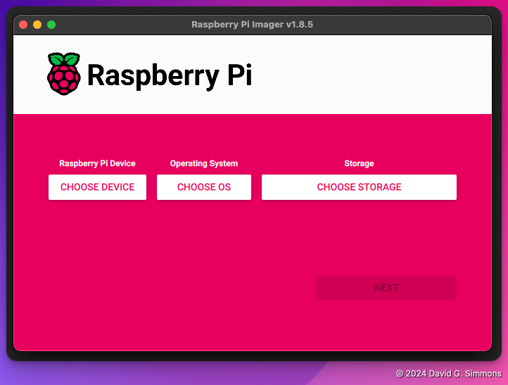
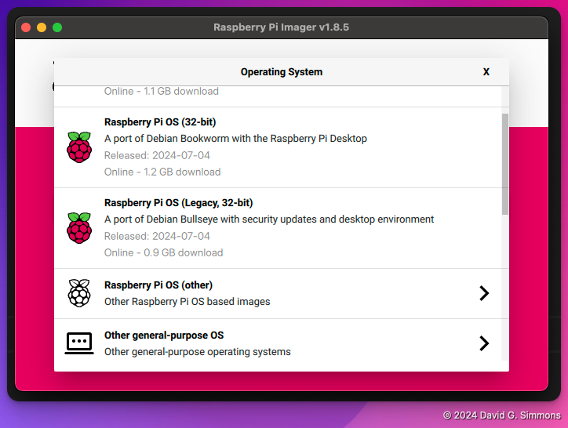

+++
title = 'Creating an image'
date = 2024-10-24T14:48:01-04:00
weight = 2
+++

## Starting Pi Imager

When you first start the Pi Imager, you'll see that you have to make some choices:

First, you'll want to choose which Pi model you have. We're using Pi 4s

Next, you'll choose the Operating System. We are going to use the most recent version (Bookworm, 64-bit), but we won't be needing the full Desktop environment, so choose the 'Lite' version.

Next, you’ll identify the Micro SD Card you’d like to write to. If you haven’t already, insert the Micro SD Card into SD Card writer and plug it in to your computer.

The last step before actually writing the OS to the disk is to set any additional settings you'd like for the Pi. I recommend at least setting up a hostname and username/password, and if you would like to use your local WiFi, the WiFi credentials.

For this exercise, set the following:
- `hostname`: Choose something unique! We will all be on the same LAN, so make it something unique to this LAN
- `username`: I use `zymbit` for the username, but you can choose whatever you like
- `password`: For ease of use, I use `zymbit` here as well, but that's clearly not secure, so choose whatever password you can reliably remember
- `SSID`: We will be using a local WiFi Hotspot, so enter `zymbit-lab` here.
- `password`: The WiFi `zymbit-lab` uses the password `zymbit-lab-wifi` so enter that here.

We will need to login via ssh, so turn on ssh, and allow password logins

Once you've got all the settings right, it's time to write it all to the card. Note that this will completely erase any existing data on the SD Card, so be careful.

After that, you can sit back and enjoy a cup of coffee while your OS is written to the card. Once it's done, we can move on to configuring the hardware.

