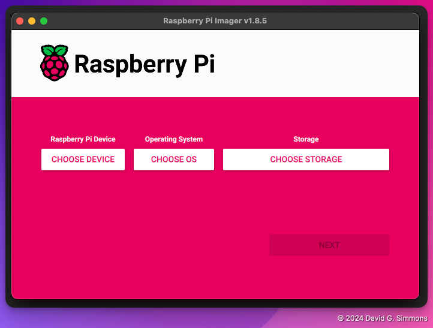
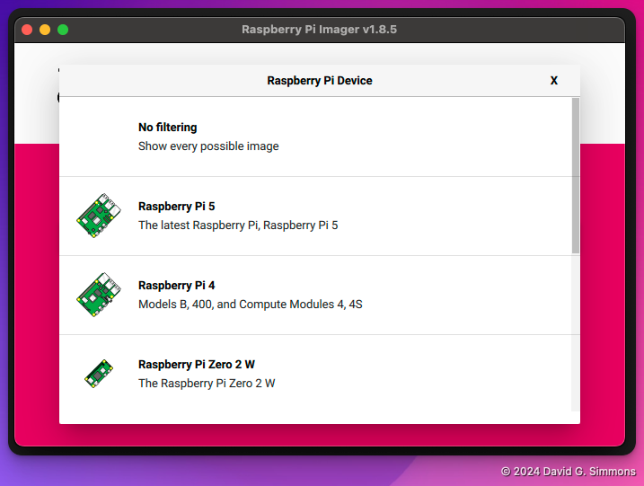
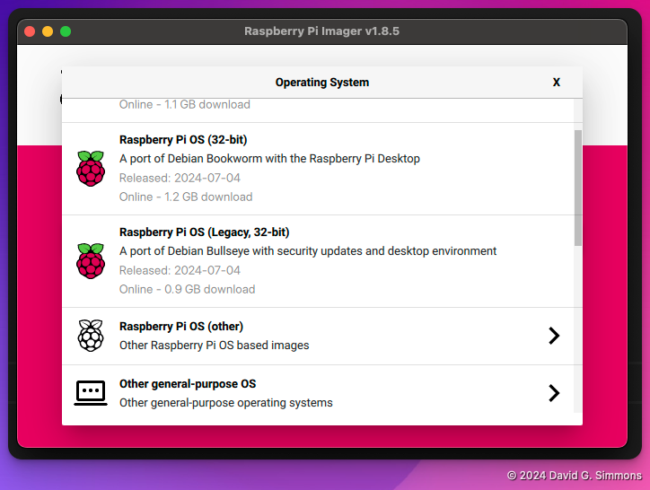
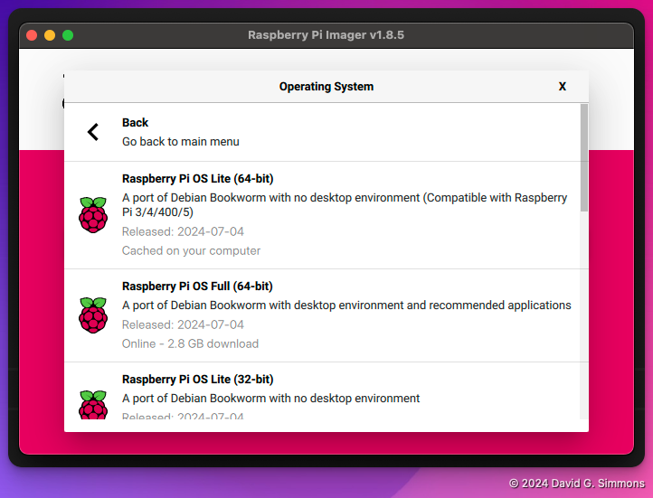
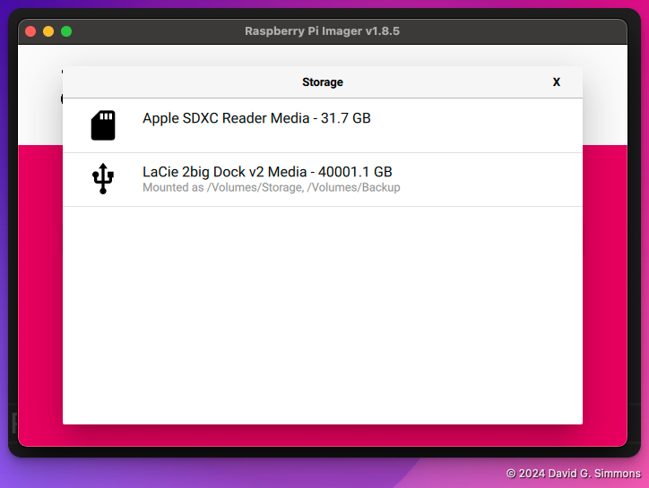
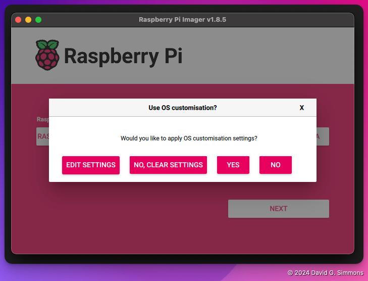
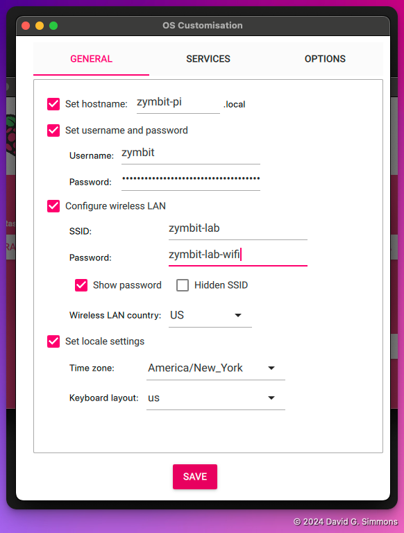
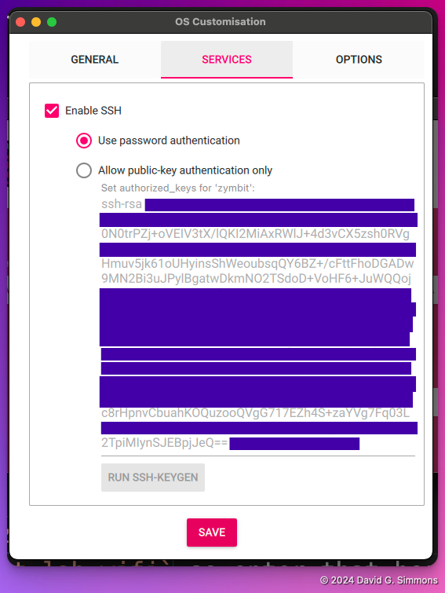
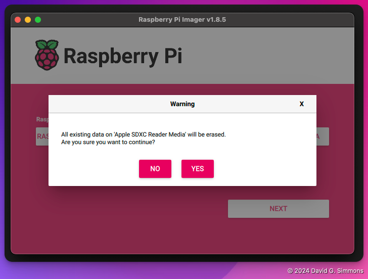

## Démarrage de Pi Imager

Lorsque vous démarrez le Pi Imager pour la première fois, vous verrez que vous devez faire certains choix :

Tout d'abord, vous devez choisir le modèle de Pi que vous possédez. Nous utilisons des Pi 4

Ensuite, vous choisirez le système d'exploitation. Nous allons utiliser la version la plus récente (Bookworm, 64 bits), mais nous n'aurons pas besoin de l'environnement de bureau complet, alors choisissez la version « Lite ».

Ensuite, vous devez identifier la carte Micro SD sur laquelle vous souhaitez écrire. Si vous ne l'avez pas déjà fait, insérez la carte Micro SD dans le graveur de carte SD et branchez-le sur votre ordinateur.

La dernière étape avant d'écrire réellement le système d'exploitation sur le disque consiste à définir les paramètres supplémentaires que vous souhaitez pour le Pi. Je recommande au moins de configurer un nom d'hôte et un nom d'utilisateur/mot de passe, et si vous souhaitez utiliser votre WiFi local, les informations d'identification WiFi.

Pour cet exercice, définissez les éléments suivants :
- `hostname` : choisissez quelque chose d'unique ! Nous serons tous sur le même réseau local, alors faites en sorte que ce réseau local soit unique
- `username` : j'utilise `zymbit` pour le nom d'utilisateur, mais vous pouvez choisir ce que vous voulez
- `password` : pour plus de facilité d'utilisation, j'utilise également `zymbit` ici, mais ce n'est clairement pas sécurisé, alors choisissez le mot de passe dont vous pouvez vous souvenir de manière fiable
- `SSID` : nous utiliserons un point d'accès Wi-Fi local, saisissez donc `zymbit-lab` ici.
- `password` : Le WiFi `zymbit-lab` utilise le mot de passe `zymbit-lab-wifi` donc entrez-le ici.

Nous devrons nous connecter via ssh, alors activez ssh et autorisez les connexions par mot de passe

Une fois tous les paramètres définis, il est temps d'écrire le tout sur la carte. Notez que cette opération effacera complètement toutes les données existantes sur la carte SD, alors soyez prudent.

Après cela, vous pouvez vous asseoir et savourer une tasse de café pendant que votre système d'exploitation est écrit sur la carte. Une fois cela fait, nous pouvons passer à la configuration du matériel.


