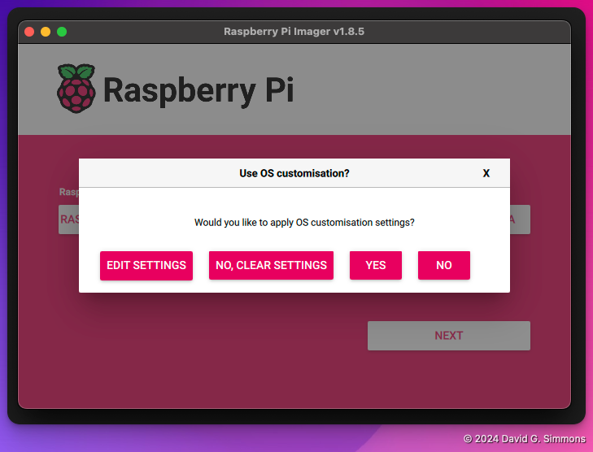
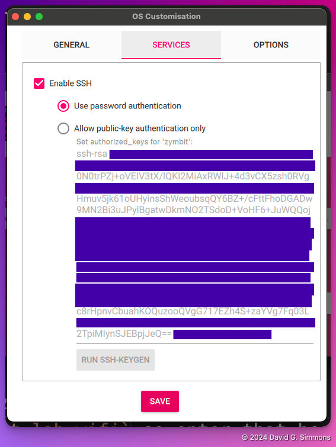

## Pi Imager starten

Wanneer u de Pi Imager voor het eerst opstart, zult u zien dat u een aantal keuzes moet maken:

Eerst wil je kiezen welk Pi-model je hebt. Wij gebruiken Pi 4s

Vervolgens kiest u het besturingssysteem. We gaan de meest recente versie gebruiken (Bookworm, 64-bit), maar we hebben niet de volledige desktopomgeving nodig, dus kies de 'Lite'-versie.

Vervolgens identificeert u de Micro SD-kaart waarnaar u wilt schrijven. Als u dat nog niet hebt gedaan, plaatst u de Micro SD-kaart in de SD-kaartschrijver en sluit u deze aan op uw computer.

De laatste stap voordat u het besturingssysteem daadwerkelijk naar de schijf schrijft, is het instellen van eventuele aanvullende instellingen die u voor de Pi wilt. Ik raad aan om in ieder geval een hostnaam en gebruikersnaam/wachtwoord in te stellen, en als u uw lokale wifi wilt gebruiken, de wifi-referenties.

Voor deze oefening moet u het volgende instellen:
- `hostname`: Kies iets unieks! We zullen allemaal op hetzelfde LAN zitten, dus maak het iets unieks voor dit LAN
- `gebruikersnaam`: Ik gebruik `zymbit` voor de gebruikersnaam, maar u kunt zelf kiezen wat u wilt
- `password`: Voor het gebruiksgemak gebruik ik hier ook `zymbit`, maar dat is duidelijk niet veilig, dus kies een wachtwoord dat u goed kunt onthouden
- `SSID`: We gebruiken een lokale WiFi-hotspot, dus voer hier `zymbit-lab` in.
- `password`: De WiFi `zymbit-lab` gebruikt het wachtwoord `zymbit-lab-wifi`, dus voer dat hier in.

We moeten inloggen via ssh, dus schakel ssh in en sta wachtwoord-aanmeldingen toe

Zodra je alle instellingen goed hebt, is het tijd om alles naar de kaart te schrijven. Let op: hiermee worden alle bestaande gegevens op de SD-kaart volledig gewist, dus wees voorzichtig.

Daarna kunt u achterover leunen en genieten van een kop koffie terwijl uw OS naar de kaart wordt geschreven. Zodra het klaar is, kunnen we doorgaan met het configureren van de hardware.


