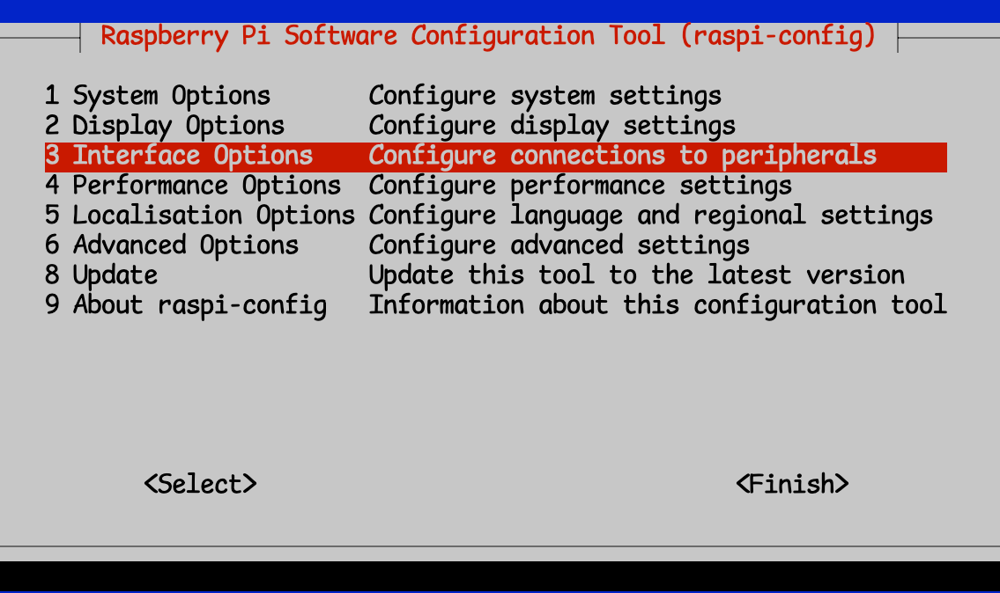

Now it's time to plug the Pi in to the power supply, wait for it to boot, and get started setting up our security!

First, let's login to your Pi. Remember the hostname you gave it back while you were [Configuring your SD Card](chapter3/page2/)? You'll need that, and the username/password that you set. You will also need a terminal application.

> [!IMPORTANT]
> On macOS, you can go to Applications –> Utilities –> Terminal.app
> On Linux, and XTerm or Terminal app will work
> On Windows, you will need [Putty](https://www.putty.org) or a similar Terminal application

> [!TIP]
> **Windows users**
>
> The best solution for Windows is to make sure that you have WSL installed and active. This will give you access to a proper command line that you can use for `ssh`, etc. To install WSL, see the instructions provided [here](https://davidgs.com/zymbit-workshop/index.html)


```bash
ssh <username>@<hostname.local>
```
Then enter the password you set previously.  Since I called my Pi `zymbit-pi` and set the username and password both to `zymbit` I would use

```bash
ssh zymbit@zymbit-pi.local
zymbit@zymbit-pi.local's password: <zymbit>
...
zymbit-pi:~  $
```
And you're now logged in to your Raspberry Pi!

Before we can configure the Zymkey, we need to ensure that the Pi can talk to it. The Zymkey software communicates with the device via I2C, so we need to make sure that the Pi's I2C interface is enabled.

```bash
$ sudo raspi-config
```
Gets you to the configuration utility.



You'll then select "Interface Options" and then "I2C"


You can then exit and save raspi-config


It's no longer necessary to reboot your Pi after this.

One last thing before we continue. It's probably a good idea to make sure that the OS is fully up to date. You can run the following 2 commands:

```bash
sudo apt update
sudo apt upgrade
```

> [!TIP]
> If you get tired of adding `sudo` to all of these management commands, you can enter
> ```bash
> sudo -i
> ```
> Which will get you a `root` shell. But remember, with great power comes great responsibility!

You will then want to reboot your Pi to apply all the changes.

```bash
sudo reboot
```

And wait for the reboot to complete.

